# Kural Sevi (குரல் செவி) — Architectural Specification & Diagram Blueprint

> **PM-AJAY GIA · Problem Statement #26097**  
> *Department of Social Justice and Empowerment (MoSJE), Government of India*  
> **Status**: Verified against current production codebase. **Twilio has been completely replaced with Exotel Cloud Telephony.**

---

## 1. Executive Summary & Tech Stack Audit

| Architectural Domain | Active Production Tool / Technology | Status / Details | Former / Deprecated Tool |
|---|---|---|---|
| **PSTN / Cloud Telephony** | **Exotel Cloud Telephony** (India) | Bidirectional WebSocket (`/ws/exotel-voicebot`) + ExoML Webhooks (`/webhooks/exotel/*`) | ~~Twilio Voice~~ *(Completely Removed)* |
| **WhatsApp Intake & Feedback** | **Self-Hosted Baileys Bot** (`@whiskeysockets/baileys`) | Multi-device WebSocket listener on port `5005`, citizen feedback loop (`/api/citizen-confirm`) | ~~Twilio WhatsApp API~~ *(Removed)* |
| **Cellular SMS Gateway** | **Fast2SMS API** & **Android SMS Gateway** | DLT-compliant Indian transactional SMS + local cellular device hub | ~~Twilio SMS~~ *(Removed)* |
| **Speech-to-Text (STT)** | **Sarvam AI (Saaras Model)** | Multilingual Indic ASR (Tamil `ta-IN`, Hindi `hi-IN`, Telugu `te-IN`) | — |
| **Sovereign STT Fallback** | **Bhashini (MeitY)** | Sovereign Indian government speech recognition pipeline | — |
| **LLM Reasoning & Dialogue** | **Google Gemini 2.5 Flash** | Intent recognition, 7-field livelihood extraction, conversational dialogue | — |
| **LLM Circuit-Breakers** | **Groq API** (`qwen/qwen3.8-27b`) & **OpenRouter** (`meta-llama/llama-3.3-70b-instruct`) | Ultra-low latency fallback inference when primary LLM encounters rate limits or latency spikes | — |
| **Text-to-Speech (TTS)** | **Sarvam AI (Bulbul v3 Model)** | Regional neural voices (`kavitha`, `priya`) | — |
| **Vector Embeddings** | **Google Gemini Embeddings** (`text-embedding-004`) | 768-dimensional semantic embeddings | — |
| **Vector Similarity Search** | **Supabase pgvector** | PostgreSQL extension with IVFFlat index using cosine distance (`<=>`) | — |
| **Recommendation Engine** | **`@kural-sevi/recommendation-engine`** | Hexagonal Architecture: Hard Filters $\rightarrow$ pgvector Cosine $\rightarrow$ AHP-TOPSIS MCDM | — |
| **Database & Identity** | **Supabase PostgreSQL 15+** | Row-Level Security (RLS) district scoping, `pgcrypto` cryptographic hashing | — |
| **Data Pipelines & Ingestion** | **Supabase Edge Functions (Deno)** | `weekly-ingest` (pulls from `api.data.gov.in` e-Shram/Udyam) & `batch-aggregate` (daily 02:00 IST) | — |
| **Officer Portal & Workstation**| **Next.js 15 (React 19, TypeScript)** | App Router, Tailwind CSS, Radix UI, Lucide Icons, Telephony Workstation | — |

---

## 2. High-Level Architectural Diagram (Mermaid)

Use this complete, validated Mermaid script in draw.io, Mermaid Live Editor, or Markdown viewers:

```mermaid
flowchart TB
    %% =========================================================================
    %% STYLING PALETTE (Flag Code & Minimalist Indian Governance Discipline)
    %% Ashok Chakra Blue: #0B3064 | Saffron/Kesari: #E05A1B | India Green: #0A783C
    %% =========================================================================
    classDef intake fill:#0B3064,stroke:#BACEEB,stroke-width:2px,color:#FFFFFF;
    classDef voice fill:#1E293B,stroke:#38BDF8,stroke-width:2px,color:#F8FAFC;
    classDef recEngine fill:#0F172A,stroke:#E05A1B,stroke-width:2px,color:#F8FAFC;
    classDef dataLayer fill:#022C22,stroke:#10B981,stroke-width:2px,color:#F8FAFC;
    classDef officerPortal fill:#0B3064,stroke:#E05A1B,stroke-width:2px,color:#FFFFFF;
    classDef external fill:#1E293B,stroke:#94A3B8,stroke-dasharray: 4 4,color:#F1F5F9;

    %% ─────────────────────────────────────────────────────────────────────────
    %% TIER 1: MULTI-CHANNEL INGESTION (OMNICHANNEL EDGE)
    %% ─────────────────────────────────────────────────────────────────────────
    subgraph TIER1 ["TIER 1: Beneficiary Multi-Channel Ingestion (Omnichannel Edge)"]
        direction LR
        IVR["📞 Exotel IVR Telephony\n(Indian Cloud PSTN · 04447615330)\nTRAI/DoT Compliant"]:::intake
        WA["💬 WhatsApp Bot Gateway\n(Self-Hosted Baileys Socket :5005)\nVoice Notes & Interactive Text"]:::intake
        WEB_INTAKE["📝 Field Officer Assisted Portal\n(Next.js 15 Web Workstation)\nDirect Gram Panchayat Enrollment"]:::intake
    end

    %% ─────────────────────────────────────────────────────────────────────────
    %% TIER 2: VOICE & AI ORCHESTRATION LAYER (FASTAPI)
    %% ─────────────────────────────────────────────────────────────────────────
    subgraph TIER2 ["TIER 2: Voice & AI Orchestration Layer (FastAPI :8000)"]
        direction TB
        subgraph ROUTERS ["Telephony & Transport Routers"]
            EXO_WS["Exotel Voicebot WS Router\n(/ws/exotel-voicebot · 8kHz PCM)"]:::voice
            EXO_HTTP["ExoML Webhook Router\n(/webhooks/exotel/interview-turn)"]:::voice
            DIAL_API["Outbound Dialer Endpoint\n(POST /calls/dial via Exotel API)"]:::voice
            CONFIRM_API["Citizen Confirm Webhook\n(POST /api/citizen-confirm)"]:::voice
        end

        subgraph SPEECH_PIPELINE ["Speech & Intelligence Core"]
            AUDIO_FILTER["Audio Conditioner\n(FFmpeg · μ-law to 16-bit PCM · Noise Gate)"]:::voice
            STT["Sarvam AI STT\n(Saaras Model · Tamil / Hindi / Telugu)"]:::voice
            LLM["Google Gemini 2.5 Flash\n(Field Normalization & Extraction)"]:::voice
            TTS["Sarvam AI TTS\n(Bulbul v3 · kavitha / priya)"]:::voice
        end

        subgraph FSM_VAULT ["Dialogue State & Compliance Vault"]
            FSM["Dialogue FSM\n(8-State Machine · 7 PM-AJAY Fields)"]:::voice
            RESUME["Disconnect Recovery Engine\n(FR-13a Session Token Resumption)"]:::voice
            DPDP["DPDP 2023 Compliance Vault\n(HMAC-SHA256 Aadhaar · Verbal Consent)"]:::voice
        end

        NOTIF["Outbound Dispatch Engine\n(Fast2SMS API + WhatsApp Web Bot)"]:::voice
    end

    %% ─────────────────────────────────────────────────────────────────────────
    %% TIER 3: HEXAGONAL RECOMMENDATION ENGINE
    %% ─────────────────────────────────────────────────────────────────────────
    subgraph TIER3 ["TIER 3: 3-Stage Hexagonal Recommendation Engine (@kural-sevi)"]
        direction LR
        STAGE1["Stage 1: Hard Constraint Filter\n(Prunes on Education, Mobility,\nDisability, Age & Gender)"]:::recEngine
        STAGE2["Stage 2: Vector Search\n(pgvector 768d Cosine Search\nOver 40+ NSQF QP-NOS Trades)"]:::recEngine
        STAGE3["Stage 3: AHP-TOPSIS MCDM\n(Income, Demand, Duration,\nSkill Gap Multi-Criteria Ranking)"]:::recEngine
        XAI["Explainable AI (XAI) & Confidence\n(HIGH / MEDIUM / NEEDS_REVIEW\nPlain-Language Regional Justifications)"]:::recEngine
    end

    %% ─────────────────────────────────────────────────────────────────────────
    %% TIER 4: ENTERPRISE DATA & KNOWLEDGE LAYER
    %% ─────────────────────────────────────────────────────────────────────────
    subgraph TIER4 ["TIER 4: Enterprise Data & Knowledge Layer (Supabase PostgreSQL 15)"]
        direction TB
        subgraph RELATIONAL_DB ["PostgreSQL 15 (Row-Level Security Enforced)"]
            T_BENEFICIARIES[("beneficiaries\n(Anonymized PII · phone_hash · aadhaar_hash)")]:::dataLayer
            T_SESSIONS[("sessions & session_fields\n(FSM State · Confidence · Turn Transcripts)")]:::dataLayer
            T_PROFILES[("profiles\n(Confirmed 7 Fields · skills_embedding 768d)")]:::dataLayer
            T_RECS[("recommendations & officer_cases\n(Top-3 Pathways · SLA Timers · Approvals)")]:::dataLayer
            T_AUDIT[("audit_log\n(Append-Only · DO INSTEAD NOTHING Rules)")]:::dataLayer
        end

        subgraph VECTOR_STORE ["Vector & Reference Knowledge"]
            T_CATALOG[("nsqf_catalog\n(40+ Seeded Trades · IVFFlat Index)")]:::dataLayer
            T_CACHE[("district_data_cache\n(Cached e-Shram & Udyam Indicators)")]:::dataLayer
        end

        subgraph EDGE_FUNCTIONS ["Scheduled Supabase Edge Functions (Deno)"]
            EDGE_INGEST["weekly-ingest Cron\n(Sunday 01:00 IST · Pulls data.gov.in)"]:::dataLayer
            EDGE_AGG["batch-aggregate Cron\n(Daily 02:00 IST · District Metrics)"]:::dataLayer
        end
    end

    %% ─────────────────────────────────────────────────────────────────────────
    %% EXTERNAL SOVEREIGN & CLOUD APIS
    %% ─────────────────────────────────────────────────────────────────────────
    subgraph EXT_SERVICES ["External Sovereign & Cloud Services"]
        SARVAM_CLOUD["Sarvam AI Cloud\n(Indic STT & TTS API)"]:::external
        BHASHINI["Bhashini MeitY ASR\n(Sovereign STT Fallback)"]:::external
        GEMINI_CLOUD["Google AI (Gemini 2.5 Flash\n& 768d Embeddings)"]:::external
        GROQ_FALLBACK["Groq API / OpenRouter\n(Qwen 2.5 & Llama 3.3 Fallback)"]:::external
        DATA_GOV["data.gov.in\n(e-Shram & Udyam Registries)"]:::external
    end

    %% ─────────────────────────────────────────────────────────────────────────
    %% TIER 5: DISTRICT ADMINISTRATION & OFFICER PORTAL
    %% ─────────────────────────────────────────────────────────────────────────
    subgraph TIER5 ["TIER 5: District Administration & Officer Portal (Next.js 15 :3000)"]
        direction LR
        QUEUE["📋 SLA Review Queue\n(3-Day SLA Timers · Priority Sort)"]:::officerPortal
        CALLS["🎧 Telephony Workstation\n(Transcripts, Live Logs, Audio Audio)"]:::officerPortal
        ACTIONS["⚖️ Sanction Actions\n(Approve Green · Modify · Reject)"]:::officerPortal
        PLANNING["📈 District Intelligence\n(Demand Trends · CSV/JSON Export)"]:::officerPortal
    end

    %% ─────────────────────────────────────────────────────────────────────────
    %% INTER-COMPONENT FLOW CONNECTORS
    %% ─────────────────────────────────────────────────────────────────────────
    %% Ingestion to Voice API
    IVR <-->|Bidirectional μ-law / PCM Stream| EXO_WS
    IVR <-->|HTTP Webhook & ExoML Playback| EXO_HTTP
    WA -->|Inbound Voice Note / Text| CONFIRM_API
    WEB_INTAKE -->|Direct Beneficiary Form| FSM

    %% Voice API Internals
    EXO_WS --> AUDIO_FILTER
    EXO_HTTP --> AUDIO_FILTER
    AUDIO_FILTER --> STT
    STT --> LLM
    LLM --> FSM
    FSM --> TTS
    TTS -->|Synthesized 8kHz Audio| EXO_WS
    TTS -->|Cached WAV Audio| EXO_HTTP
    FSM --> RESUME
    FSM --> DPDP
    FSM --> NOTIF
    NOTIF -->|Bilingual WhatsApp Summary| WA

    %% External API Connections
    STT -.->|Regional Indic Audio| SARVAM_CLOUD
    STT -.->|Failover Sovereign Speech| BHASHINI
    TTS -.->|Neural Voice Synthesis| SARVAM_CLOUD
    LLM -.->|Extraction Prompts| GEMINI_CLOUD
    LLM -.->|Circuit-Breaker Failover| GROQ_FALLBACK
    EDGE_INGEST -.->|Fetch District Labour Data| DATA_GOV

    %% Engine Flow
    FSM -->|Trigger Recommendation on 7 Confirmed Fields| STAGE1
    STAGE1 --> STAGE2
    STAGE2 <-->|Vector Cosine Distance Match| T_CATALOG
    STAGE2 --> STAGE3
    STAGE3 <-->|Read Market Demand| T_CACHE
    STAGE3 --> XAI

    %% Persistence Flow
    DPDP -->|Store Consent & Anonymized Record| T_BENEFICIARIES
    FSM -->|Store Turns & Session State| T_SESSIONS
    FSM -->|Persist Confirmed Profile & Vector| T_PROFILES
    XAI -->|Persist Top-3 Pathways| T_RECS
    FSM -->|Append System Event| T_AUDIT
    EDGE_INGEST -->|Update Registry Cache| T_CACHE
    EDGE_AGG -->|Store Aggregated Metrics| RELATIONAL_DB

    %% Officer Portal Flow (RLS Scoped)
    T_RECS -->|District Filtered Cases| QUEUE
    T_SESSIONS -->|Turn Transcripts & Audio Recordings| CALLS
    RELATIONAL_DB -->|Precomputed District Trends| PLANNING
    ACTIONS -->|Commit Sanction Decision| T_RECS
    ACTIONS -->|Audit Officer Decision| T_AUDIT
```



---

## 3. Deep Dive: Layer-by-Layer Components & Specifications

### Layer 1: Beneficiary Multi-Channel Ingestion (Omnichannel Edge)

1. **Exotel Cloud Telephony (PSTN / Mobile)**:
   * **Role**: Primary intake channel for rural Scheduled Caste (SC) citizens on standard feature phones (2G/3G/4G).
   * **Phone Number**: Dedicated Indian DID (`04447615330`).
   * **Inbound & Outbound Calling**:
     * Inbound calls trigger `/webhooks/exotel/interview-start` or WebSocket connection.
     * Outbound calls triggered via `/calls/dial` to Exotel Connect API.
   * **No Twilio Dependency**: Twilio has been replaced with Exotel due to Indian TRAI/DoT telecommunications compliance and domestic routing latency.
2. **WhatsApp Bot Gateway (`apps/whatsapp-bot`)**:
   * **Engine**: Node.js microservice running `@whiskeysockets/baileys` on port `5005`.
   * **Role**: Handles inbound voice notes (`audio/ogg; codecs=opus`) and text replies from smartphone users.
   * **Citizen Feedback Loop**: When a citizen replies to their post-interview notification (`YES`, `1`, `2`), Baileys forwards the payload to `/api/citizen-confirm` on the Voice API.
3. **Field Worker Assisted Portal (`apps/web`)**:
   * **Role**: On-ground portal used by Village Administrative Officers (VAO), Gram Panchayat workers, or survey enumerators to profile beneficiaries directly.
4. **Outbound Notification Gateway (`apps/voice-api/services/notification_service.py`)**:
   * Dispatches case reference codes (e.g., `KS-2026-00042`) and top trade summaries via **Fast2SMS API** (DLT-registered Indian transactional route) or self-hosted **Android Cellular SMS Gateway**.

---

### Layer 2: Voice & AI Orchestration Layer (`apps/voice-api`)

* **Technology**: FastAPI (Python 3.11+, ASGI Uvicorn on port `8000`).
* **Subsystems**:
  1. **Audio Conditioner & Transcoder (`services/audio_filter.py`)**:
     * Handles dynamic transcoding between μ-law (8kHz), MP3, WAV, and 16-bit linear PCM (8kHz/16kHz) with silence gating and acoustic echo prevention.
  2. **Speech-to-Text (STT) (`services/stt_service.py`)**:
     * **Primary**: Sarvam AI *Saaras* model with high accuracy across Tamil, Hindi, and Telugu dialects.
     * **Sovereign Fallback**: MeitY Bhashini API for government-mandated sovereign air-gapped processing.
  3. **Dialogue Finite State Machine (`services/interview_fsm.py`)**:
     * 8 States: `initiated` $\rightarrow$ `consent_pending` $\rightarrow$ `consent_captured` $\rightarrow$ `field_collection` $\rightarrow$ `confirmation` $\rightarrow$ `completed` (with `dropped`/`abandoned` exception branches).
     * Guides the beneficiary through the **7 PM-AJAY Mandated Profiling Fields**:
       1. Educational Background
       2. Family Occupation
       3. Current Livelihood
       4. Skills and Interests
       5. Mobility & Disability Constraints
       6. Employment Preference (Wage / Self / Home Enterprise)
       7. Location & District Economic Context
  4. **Session Recovery & Disconnect Resume (`services/session_manager.py`)**:
     * Implements **FR-13a**: Assigns temporary session tokens stored in Supabase. When a rural cellular call drops, the system resumes the interview from `last_confirmed_field`.
  5. **LLM Extraction & Reasoning (`services/llm_service.py`)**:
     * **Primary**: Google Gemini 2.5 Flash (`gemini-2.5-flash`).
     * **Circuit Breakers**: Automatic failover to Groq (`qwen/qwen3.8-27b`) or OpenRouter (`meta-llama/llama-3.3-70b-instruct`) on API timeout or rate limiting.
  6. **Text-to-Speech (TTS) (`services/tts_service.py`)**:
     * Sarvam AI *Bulbul v3* neural synthesis in regional voices (`kavitha`, `priya`).
  7. **DPDP Act 2023 Compliance & Cryptographic Vault**:
     * Verbal consent audio captured and cryptographically linked.
     * `consent_text_hash` generated via SHA-256.
     * Aadhaar stored exclusively as HMAC-SHA256 hash (`aadhaar_hash`).
     * Beneficiary names encrypted using AES-256 (`name_encrypted`).
     * Right to erasure handled via `erased_at` soft-delete timestamp.

---

### Layer 3: 3-Stage Hexagonal Recommendation Engine (`packages/recommendation-engine`)

* **Technology**: Pure TypeScript Clean Architecture (Ports & Adapters via `ports.ts` and `adapters.ts`).
* **The 3 Pipeline Stages**:
  1. **Stage 1: Hard Constraint Filtering (`stage1-hard-filter.ts`)**:
     * Prunes ineligible trades based on:
       * Minimum education years (`min_education_years`).
       * Physical strength & disability requirements (`requires_physical_strength`).
       * Travel radius & mobility requirements (`requires_mobility`).
       * Gender preference / eligibility (`gender_eligible`).
  2. **Stage 2: pgvector Semantic Cosine Search (`stage2-pgvector-search.ts`)**:
     * Transforms skills and interests into 768-dimensional vector embeddings using Google Gemini Embeddings.
     * Queries Supabase `nsqf_catalog` using cosine distance operator `<=>`.
     * Retrieves top 15 semantically similar trades.
  3. **Stage 3: Multi-Criteria Decision Making (AHP-TOPSIS) (`stage3-ahp-topsis.ts`)**:
     * Applies **Analytical Hierarchy Process (AHP)** to calculate dynamic criteria weights:
       * *Income Potential* (Weight: ~0.35)
       * *Local Market Demand* from e-Shram / Udyam (Weight: ~0.30)
       * *Skill Gap Size* (Weight: ~0.20)
       * *Training Duration in Hours* (Weight: ~0.15)
     * Applies **TOPSIS** ranking to evaluate candidates against the ideal positive and negative solutions.
  4. **Confidence & Explainable AI (XAI) (`confidence.ts`, `explanation.ts`)**:
     * Multi-factor scoring derives confidence: `HIGH`, `MEDIUM`, or `NEEDS_OFFICER_REVIEW`.
     * Generates plain-language auditable justifications in local languages (Tamil, Hindi, Telugu) explaining why each trade was recommended.

---

### Layer 4: Enterprise Data & Knowledge Layer (Supabase PostgreSQL 15)

* **Database Engine**: PostgreSQL 15+ hosted on Supabase Cloud.
* **Extensions**:
  * `vector` (pgvector): 768-dimensional IVFFlat index on `trade_embedding` and `skills_embedding`.
  * `pgcrypto`: UUID generation (`gen_random_uuid()`) and HMAC-SHA256 calculation.
* **Table Schema & Multi-Tenancy**:
  * `beneficiaries`: Anonymized identity records with portable case IDs (`KS-2026-XXXXX`).
  * `consent_records`: Immutable consent audit trail with 5-year retention period.
  * `sessions` & `session_fields`: Call telemetry, turn-by-turn speech excerpts, running STT confidence.
  * `profiles`: Confirmed 7-field livelihood profiles + 768d vector embeddings.
  * `nsqf_catalog`: 40+ seeded NSQF occupational standards with QP codes (e.g., `APP/Q0301`).
  * `district_data_cache`: External economic data ingested from e-Shram and Udyam.
  * `recommendations`: Top-3 ranked recommendations with AHP/TOPSIS scoring breakdown.
  * `officer_cases`: Officer review queue with SLA tracking (3-day deadline).
  * `planning_aggregates`: Precomputed district-level statistics.
  * `audit_log`: Append-only log with PostgreSQL `DO INSTEAD NOTHING` update/delete prevention rules.
* **Row-Level Security (RLS)**:
  * Strict multi-tenancy enforced at the database kernel:  
    `USING (district = (auth.jwt() ->> 'district') OR (auth.jwt() ->> 'role') = 'admin')`.
* **Serverless Scheduled Edge Functions (Deno)**:
  * `weekly-ingest`: Pulls weekly data from `api.data.gov.in` (e-Shram and Udyam MSME registries) every Sunday at 01:00 IST.
  * `batch-aggregate`: Calculates district skilling demand trends every day at 02:00 IST.

---

### Layer 5: District Administration & Officer Portal (`apps/web`)

* **Technology**: Next.js 15 (React 19, TypeScript, Tailwind CSS, Radix UI, Lucide Icons).
* **Port**: `http://localhost:3000`.
* **Functional Modules**:
  1. **Case Review Queue (`/officer/cases`)**:
     * Prioritizes cases by SLA deadline (3 days), high/medium confidence chips, and disability flags.
  2. **Telephony & Call Records Workstation (`/officer/calls`)**:
     * Real-time call logs (`/logs`), full turn transcripts, and verified citizen confirmation badges.
  3. **Sanction Workflow**:
     * Officer decision buttons: **Approve Sanction** (Green `#0A783C`), **Modify Pathway**, **Reject**, or **Refer to Specialist**.
  4. **District Skilling Demand Analytics (`/officer/planning`)**:
     * Aggregated charts for top requested trades, mobility barriers, and self-employment ratios.
  5. **Data Export Engine (`/officer/export`)**:
     * Export planning data to CSV or JSON for MoSJE state and central reporting.
* **National Design System & Accessibility**:
  * **Ashok Chakra Blue** (`#0B3064`): Primary authority, navigation, high-confidence indicators.
  * **Saffron / Kesari** (`#E05A1B`): Priority notices, SLA deadlines, review required states.
  * **India Green** (`#0A783C`): Reserved exclusively for confirmed sanction approvals.
  * Dual-channel accessibility (color + Lucide icon + text label) to prevent errors under red-green colorblindness.

---

## 4. Communication Protocols, Ports & Data Formats Matrix

| Communication Path | Source $\rightarrow$ Target | Protocol / Port | Data Payload Format |
|---|---|---|---|
| **Citizen $\leftrightarrow$ IVR** | Citizen $\leftrightarrow$ Exotel | PSTN / GSM | Analog / G.711 Voice Audio |
| **Exotel $\leftrightarrow$ Voice API** | Exotel $\leftrightarrow$ `voice-api` | WebSocket (`/ws/exotel-voicebot`) | Bidirectional 8kHz 16-bit linear PCM audio |
| **Exotel $\leftrightarrow$ Voice API** | Exotel $\leftrightarrow$ `voice-api` | HTTP REST (Port 8000) | Form-encoded Webhooks & ExoML XML |
| **Citizen $\leftrightarrow$ WhatsApp** | Citizen $\leftrightarrow$ `apps/whatsapp-bot` | WhatsApp Protocol (Port 5005) | OGG/Opus Voice Notes & Text Messages |
| **WhatsApp $\rightarrow$ Voice API** | `apps/whatsapp-bot` $\rightarrow$ `voice-api` | HTTP POST `/api/citizen-confirm` | JSON (`{ phone, channel, text }`) |
| **Voice API $\leftrightarrow$ Sarvam AI**| `voice-api` $\leftrightarrow$ Sarvam Cloud | HTTPS REST | Multipart audio upload & JSON transcripts/audio |
| **Voice API $\leftrightarrow$ Gemini AI**| `voice-api` $\leftrightarrow$ Google Cloud | HTTPS REST | JSON (Structured schemas & embeddings) |
| **Voice API $\leftrightarrow$ Supabase** | `voice-api` $\leftrightarrow$ Supabase | PostgreSQL Wire / Port 5432 / HTTPS | SQL queries & PostgREST JSON |
| **Web Portal $\leftrightarrow$ Supabase**| Next.js $\leftrightarrow$ Supabase | HTTPS REST / Supabase SSR | JWT-authenticated JSON (RLS Scoped) |
| **Edge Function $\leftrightarrow$ GoI Data**| Edge Function $\leftrightarrow$ `data.gov.in` | HTTPS REST | JSON (e-Shram & Udyam records) |

---

## 5. End-to-End Execution Sequence (Flow Tracing)

```
[Citizen] (PSTN Call)
   │
   ▼
[Exotel Telephony Gateway]
   │  (WebSocket: /ws/exotel-voicebot)
   ▼
[Audio Conditioner (apps/voice-api)]
   │  (16kHz PCM)
   ▼
[Sarvam AI STT (Saaras)]
   │  (Text Transcript)
   ▼
[Google Gemini 2.5 Flash]
   │  (Extracted Profile Entity JSON)
   ▼
[Dialogue FSM & Session Manager]
   │  (Validates 7 fields; checks for disconnects)
   ▼
[Sarvam AI TTS (Bulbul v3)]
   │  (Readback Audio Stream)
   ▼
[Exotel Telephony] ──> [Citizen] (Verbal Confirmation)
   │
   │ (Once all 7 fields confirmed)
   ▼
[Supabase: profiles & beneficiaries tables]
   │
   ▼
[Recommendation Engine (@kural-sevi)]
   ├─ Stage 1: Hard Filter (Prunes by mobility, education, age)
   ├─ Stage 2: pgvector Cosine Match (Finds top 15 trades in nsqf_catalog)
   ├─ Stage 3: AHP-TOPSIS MCDM (Ranks by income, demand, duration, skill gap)
   └─ XAI Generator (Builds plain-language justification & confidence score)
   │
   ▼
[Supabase: recommendations & officer_cases tables]
   ├─ Dispatches bilingual summary via SMS / WhatsApp Bot
   │
   ▼
[District Welfare Officer Portal (Next.js 15)]
   ├─ Case lands in SLA Review Queue (Filtered to officer's district)
   ├─ Officer inspects audio, transcript, and Top-3 recommendations
   └─ Officer clicks [Approve Sanction] ──> Logged in immutable audit_log
```

---

## 6. Diagram Construction Checklist for Designers

When creating your architectural visual (in draw.io, Miro, Figma, or Lucidchart):

* [x] **Replace Twilio with Exotel**: Ensure the telephony container is labeled **Exotel Cloud Telephony** with both **ExoML HTTP Webhooks** and **Bidirectional Voicebot WebSockets (`/ws/exotel-voicebot`)**.
* [x] **Add WhatsApp Baileys Bot**: Draw a dedicated Node.js microservice box on port `5005` for the self-hosted WhatsApp Web Bot linked to the `/api/citizen-confirm` endpoint.
* [x] **Highlight the 3-Stage Recommendation Engine**: Explicitly illustrate the sequential steps:
  1. *Hard Filters (Mobility & Safety)*
  2. *pgvector 768d Cosine Search*
  3. *AHP-TOPSIS MCDM Ranking + XAI*
* [x] **Show Fallback LLM & Sovereign Speech Paths**: Include dashed fallback lines to **Groq / OpenRouter** (LLM fallback) and **Bhashini MeitY** (sovereign speech fallback).
* [x] **Depict the Data Layer with RLS & Edge Crons**: Show PostgreSQL 15, pgvector 768d, immutable `audit_log`, and the two scheduled edge cron functions (`weekly-ingest` and `batch-aggregate`).
* [x] **Adopt the 3-Color Governance Palette**:
  * Primary Containers: Ashok Chakra Blue (`#0B3064`)
  * Recommendation & Alert Accents: Saffron / Kesari (`#E05A1B`)
  * Approved / Sanction Highlights: India Green (`#0A783C`)
